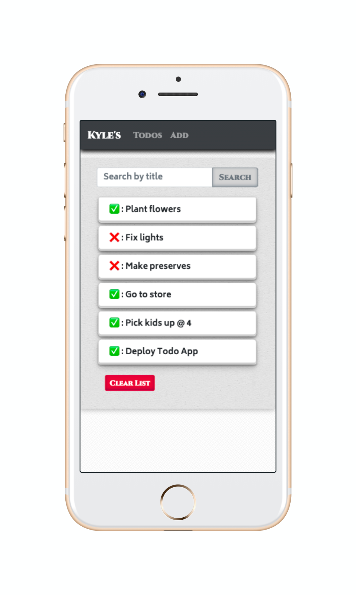

# Todo
Todo app with java Springboot rest API and Material-UI frontend.



# Set Up frontend
> Run the following commands from the root of react-frontend
```
npm i
```
```
npm run build
```
```
<move build file contents to spring-backend/target/classes/static directory>
```

# Set Up backend
> Run the following commands from the root of spring-backend
```
mvn clean install
```
```
mvn spring-boot:run
```
```
<run jar on local host or deploy to AWS>
```
